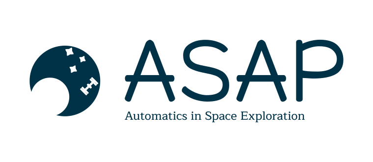

# Welcome to SpacePhyML

SpacePhyML is a framework for working with space physics datasets. It aims to bring togheter already existing datasets for ease of usage and enable the simple creation of new datasets in the future. It is built on the torch dataset class but can be used in Tensorflow.

You can find the full documentation at [https://asap-space.github.io/SpacePhyML/](https://asap-space.github.io/SpacePhyML/).

## Quick Start

### Installation
To use SpacePhyML you can install the package using pip.

```
pip install git+https://github.com/Jonah-E/SpacePhyML.git
```

### Usage

Create a dataset through the commandline tool using the dataset generator.

```
spacephyml create my_dataset.csv
```

```
from spacephyml.datasets.general.mms import ExternalMMSData

dataset = ExternalMMSData('my_dataset.csv')
```

## Automatics in Space Exploration (ASAP)



The ASAP project is dedicated to designing and developing advanced algorithms that leverage artificial intelligence to automate onboard operations for space missions. These algorithms are specifically tailored for implementation on onboard processors, enhancing the efficiency, autonomy, and reliability of space systems. By integrating AI techniques, the project aims to reduce manual intervention, optimize mission performance, and enable smarter decision-making in real-time operational scenarios.

Futher information can be found on the ASAP Project website, and the latest updates are posted on the project LinkedIn page:</br>
Website: [asap-space.eu](https://asap-space.eu)</br>
LinkedIn: [linkedin.com/company/asap-space/](https://www.linkedin.com/company/asap-space/)</br>
Youtube: [youtube.com/@ASAP-space-eu](https://www.youtube.com/@ASAP-space-eu)

---


*ASAP has received funding from the European Union’s HORIZON Research and Innovation Action under the Grant Agreement No 101082633. Views and opinions expressed are however those of the author(s) only and do not necessarily reflect those of the European Union.*

---

## 🤝 How to Contribute

Thank you for considering contributing to this project! 🎉
Whether it’s a bug report, feature suggestion, or a pull request — we appreciate it.


If you have improvements you want to make, open a issue with the tag 'enhancment' and explain the improvment. We'll check your suggestion to see that it is in line with the vision for SpacePhyML and if it have any synergy with other work ongoing. Once you have the go ahead, you can implement your improvment and create a pull request.

If you have a dataset and/or model you want to add to the framework the general process is the same as for imporovments. However, there are some considerations:

- **Dataset**: Create a file in the `datasets` folder, here you can create a class to download and extract your dataset. The class should be a valid torch dataset class. If possible use the general classes available.

- **Models:**
    1. Create a file with the model architecture in the `models/arc` folder. The architecture should inherit from the torch.nn.Module class.
    2. Create a file in the `models/` folder with a class for a pre-trained version of your model inheriting from your architecture. This class should also download and extract the necessarily files for the trained parameters.

You can look at the existing models and datasets for inspiration.

If you have an source for data labels you want to add the dataset creator, please open an issue and we can discuss how to best include this. The creator is currently under development and is very influenced by the first use-case it was developed for.

### Quick guide for code changes.

1. **Fork the repository**
2. **Clone your fork locally**
3. **Make your additions and imporovments**
4. **Push the change to your fork**
5. [**Create a pull request from your fork**](https://docs.github.com/en/pull-requests/collaborating-with-pull-requests/proposing-changes-to-your-work-with-pull-requests/creating-a-pull-request-from-a-fork)

